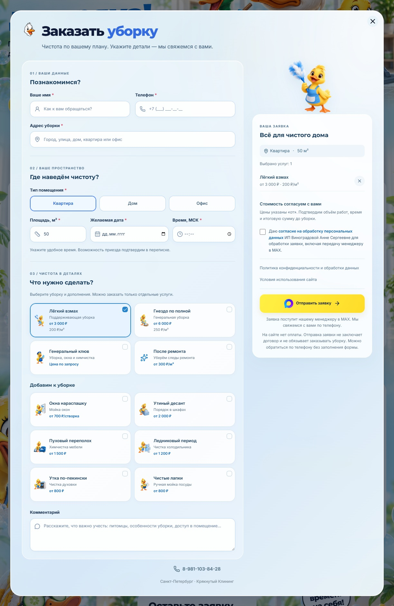

# Крякнутый Клининг

Адаптивный сайт клининговой компании в Санкт-Петербурге: авторский визуальный стиль с утками-маскотами, каталог услуг, интерактивный расчёт стоимости и интеграция заявок с мессенджером MAX.

**[Открыть демо сайта →](https://serezjjja.github.io/kryak-cleaning/)**

## Заказ уборки

Полное окно оформления заявки: контактные данные, параметры помещения, выбор услуг и итоговый состав заказа.

## Задача

Показать услуги клининга в понятном и запоминающемся интерфейсе, помочь посетителю рассчитать предварительную стоимость и составить заявку с нужными услугами.

## Решение

- Иллюстрированный первый экран с персонажами бренда и звуковой реакцией маскота.
- Каталог из девяти услуг с описаниями и ценами.
- Калькулятор с выбором помещения, площади, вида уборки и дополнительных услуг.
- Форма заявки с выбором услуг, даты, времени, адреса и контактных данных.
- Интеграция с мессенджером MAX: передача заявки менеджеру через бота и серверный обработчик.
- Отдельная компоновка для телефонов, мобильное меню и удобные элементы управления.
- Правовые страницы, доступные без JavaScript.

## Интеграция с мессенджером MAX

Реализована отправка заявок с сайта менеджеру в **MAX (Messenger MAX)** через API бота. Клиент выбирает услуги, указывает параметры помещения, удобные дату и время, адрес и контакты. Сервер проверяет данные и формирует структурированное сообщение для менеджера.

- Выбранные в калькуляторе параметры переносятся в форму заказа.
- Перед отправкой требуется отдельное согласие на обработку персональных данных.
- Серверная часть защищает от повторной отправки и ограничивает частоту запросов.
- Токен бота хранится на сервере и не попадает в браузерную сборку.
- Подготовлены обработчики на Node.js и PHP, включая комплект для хостинга REG.RU.

В публичном демо на GitHub Pages доставка заявок отключена. Интеграция входит в серверную часть проекта, которая хранится в приватном репозитории.

## Мобильная версия

Полный скриншот страницы на экране шириной 390 px.

## Технологии

React 19 · TypeScript · Tailwind CSS 4 · Radix UI · esbuild · Node.js · PHP · MAX Bot API · GitHub Pages.

## О демонстрации

В демо работают навигация, каталог, калькулятор и заполнение формы. Отправка заявок в MAX не подключена: демо не отправляет введённые данные менеджеру. Контактные ссылки ведут во внешние приложения.

Этот публичный репозиторий содержит скриншоты и готовую статическую сборку в папке `demo`. Исходные компоненты, серверная часть, тесты и история разработки хранятся в отдельном приватном репозитории. Сборка опубликована без карт исходного кода.

**Разработка сайта — [Serezjjja](https://github.com/Serezjjja).**
